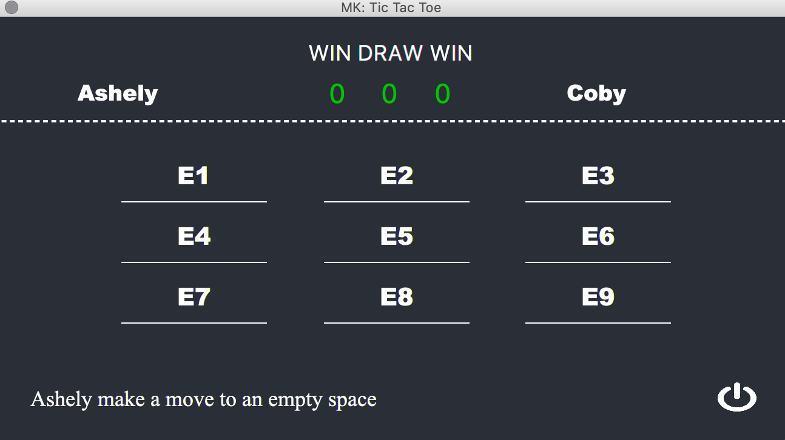
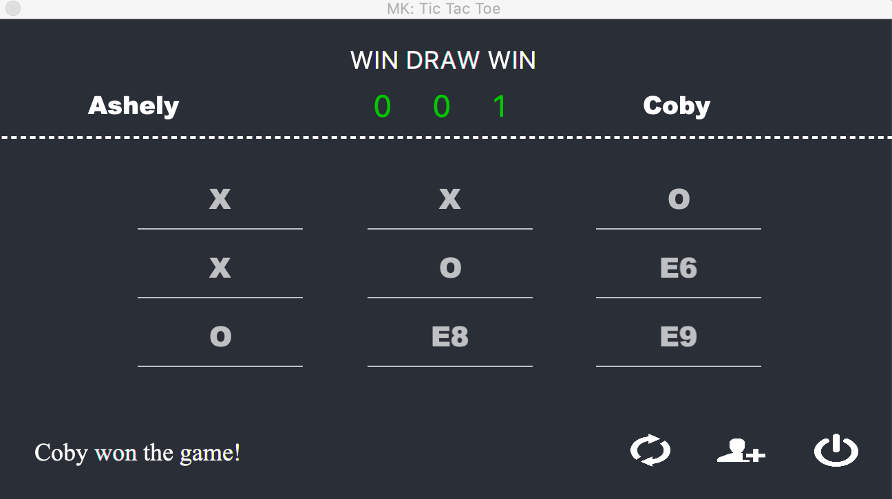

# MK: Tic Tac Toe GUI
MK Tic Tac Toe w / gui interface is a simple java game design for two player. 
The game ask both player to enter their name and after that, 
it will draw the dashboard for the players. And ask the first 
player to make a move etc. The game also keep track of the players 
score record and draw (game tie) game. If there is a win or tie, all button 
will be disable and the re-match and new game button will be visible. The 
players have the choice the choice now to either re-match, start new game or end program.

#### Below is a screen shot s of the game
First player name input screen shot

Second player name input screen shot

Screen shot of the Dashboard 

Winner and score record

Note: To run this program, you will need java 8 or higher
